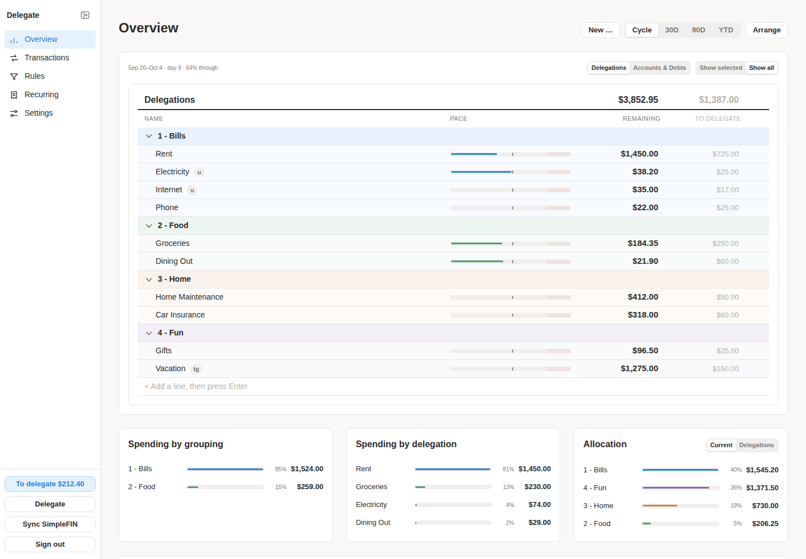
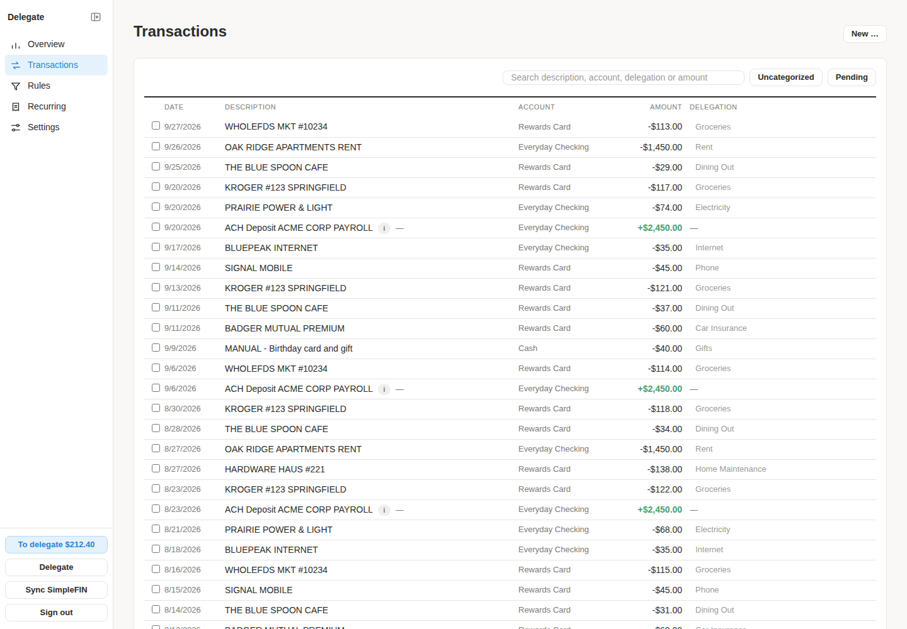
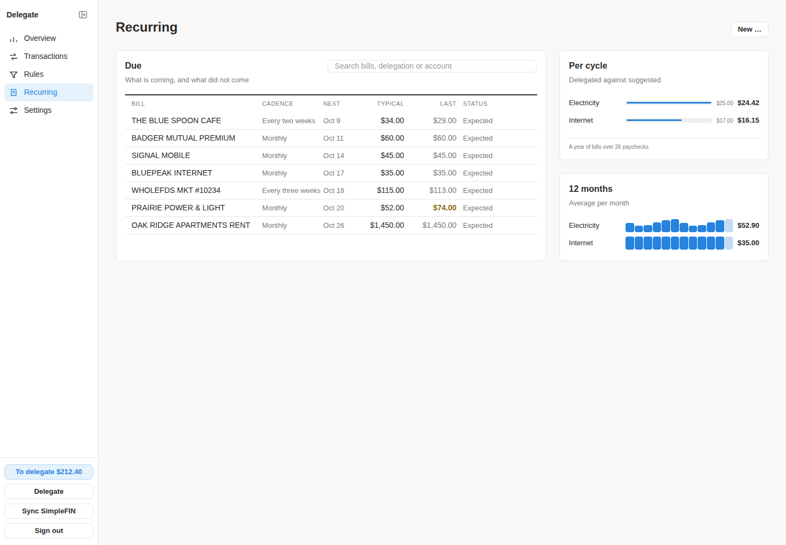
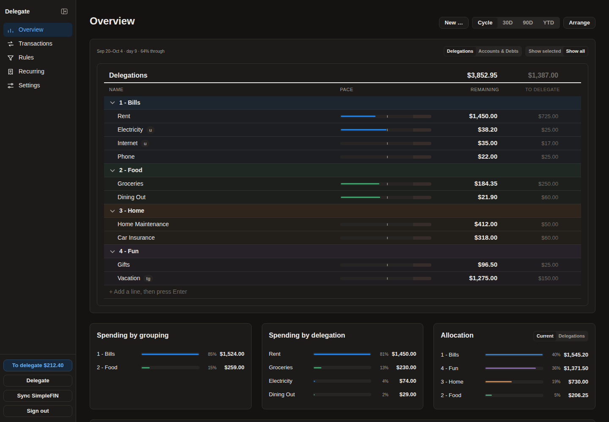
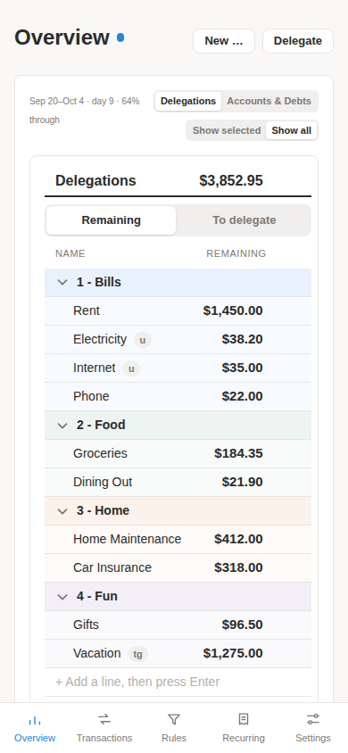

# Delegate

A self-hosted envelope budgeting application for a single household.

The name is the verb the whole system is built around: money sits in real
accounts, and every dollar is _delegated_ to a named envelope. The health of the
budget is one subtraction, recomputed on every view:

```
SUM(in-budget assets)
  − SUM(in-budget debts)
  − SUM(delegation balances)
  + SUM(pending transactions)
```

A positive reading is money that has landed and not been distributed yet — the
"available to delegate" figure. Near zero is `Balanced`. Negative is
over-delegated. The fourth term exists because categorizing a pending charge
empties its envelope at once, while most banks report a settled balance that
does not include it yet
([ADR 020](docs/decisions/020-pending-transactions-in-the-identity.md)).

See [docs/architecture.md](docs/architecture.md) for the domain model,
[docs/design.md](docs/design.md) for the visual language, and
[docs/handoff.md](docs/handoff.md) for how the project is run.

> **Reachable from away.** Two-factor authentication is required of every
> account, TOTP codes are single-use, and remote access over a Tor onion service
> is available and off until switched on from the home network. How the front
> door is arranged is the operator's decision: a tunnel, a reverse proxy, the
> onion service, or nothing at all. See
> [docs/remote-access.md](docs/remote-access.md) and ADRs 017, 024, 026 and 027.

## A look at it

Every name and figure below is invented: the real application, drawing a sample
household.



| Transactions                                                                          | Recurring                                                                                        |
| ------------------------------------------------------------------------------------- | ------------------------------------------------------------------------------------------------ |
|  |  |

| Dark                                                                | Phone                                                              |
| ------------------------------------------------------------------- | ------------------------------------------------------------------ |
|  |  |

## Status

In daily use by one household since August 2026, and developed in the open since.
Releases and what each one changed are in [CHANGELOG.md](CHANGELOG.md); every
significant decision, and why, is in [docs/decisions/](docs/decisions/).

## What it does

**The budget**

- Envelopes ("delegations") with an amount to delegate each payday. One
  **Delegate** press funds every line, and can be undone for a configurable
  window.
- **Targets** say what a line is saving towards and by when, and what each
  remaining paycheck would have to carry — without ever changing the amount
  itself. A **maximum** caps what a line may hold, and Delegate stops at it.
- Transfers between envelopes, manual adjustments, and a full per-line history.
  Balances are a cached sum of an append-only event ledger, and a check proves
  the two agree.
- Groupings with colours and a chosen order, for delegations and accounts alike.

**Transactions**

- Bank sync through [SimpleFIN](https://www.simplefin.org/), hourly, with the
  whole pending lifecycle: a pending charge moves its envelope when categorized,
  carries across when it posts, and backs out if it vanishes.
- Rules that categorize or label automatically, and suggestions learned from
  where a merchant went before.
- Splits across envelopes, transfer pairing between accounts, possible
  duplicates proposed (never archived on their own), and outstanding checks
  matched to the payment that clears them.
- **Standby mode**: charges entered by hand while a bank's feed is down, reconciled
  against the feed when it comes back.

**Reading it**

- **Overview**: the budget, a pace bar per line against the pay cycle, and a
  dashboard of tiles.
- **Recurring**: bills worked out from the register rather than entered, with the
  one that did not arrive called out, and utility costs over time.
- Net worth and a nightly snapshot of the whole picture, so history accrues from
  the first night.
- **Bitcoin** holdings as a dated ledger, watched wallets (xpub or descriptor)
  over an Esplora node of your choosing, and properties with equity against
  their mortgage.
- Notifications as small tags in the sidebar, each linking to where the
  condition is dealt with.

**Running it**

- Several people, three roles, mandatory two-factor, and a record of what
  happened to credentials.
- CSV export, nightly database dumps with a tested restore, dark mode, and a
  layout that works on a phone.
- A read-only API behind per-person tokens, for another program to read the
  budget.

**Not planned:** passkeys
([ADR 016](docs/decisions/016-passkeys-are-out-of-scope.md)), more than one
currency, and any write path for programs.

## Installing it

**One line, on anything that runs Docker.**

```bash
curl -fsSL https://raw.githubusercontent.com/aso42244/delegate/main/docker-compose.yml -o docker-compose.yml \
  && docker compose up -d
```

That is the whole install. Nothing to configure: the first start generates the
session secret, the encryption key and the database password into a volume of
their own, runs the migrations and serves on port 8088.

Then read the setup code out of the logs and open the app:

```bash
docker compose logs app | grep -A2 'no account yet'
```

The code is what claims the first account. Creating it cannot be authenticated —
there is nobody to authenticate as yet — so the code proves you are the person
who started the container.

### Connecting your bank

SimpleFIN issues a one-time **setup token**, which is exchanged once for a
long-lived **access URL**. Get a token from
[bridge.simplefin.org](https://bridge.simplefin.org/) after connecting your
institutions, then sign in, go to **Settings → Sync**, paste it, and press
Connect. The credential is stored encrypted in the database.

A setup token can only be claimed once; a second attempt returns 403 and you need
a fresh one. Sync then runs hourly. Institutions SimpleFIN does not support are
kept as manual accounts, whose balance you type.

### Getting to day one

The order matters, because balances derived from a categorized backlog are
deliberately wrong until the last step:

1. **Sync.** Pulls accounts and as much history as the feed holds — roughly six
   months in practice, whatever is asked for. See
   [ADR 009](docs/decisions/009-simplefin-sync-cadence-and-window.md).
2. **Build rules**, fastest from a transaction via "Always categorize like this".
3. **Run the rules** over the existing backlog — **Run rules** on the Rules page.
4. **Categorize the remainder** by hand on the Transactions page.
5. **Correct each envelope.** On Overview's budget, press a line's balance and
   type what it truly holds. Each correction is an ordinary manual adjustment,
   kept in that line's history.

Steps 1–4 drive delegation balances deeply negative — Grocery may read −$9,000
when its true balance is $725. That is expected: it buys full history and
accurate day-one numbers, and step 5 corrects it.

### On a public address

Give it a domain and start with the `https` profile:

```bash
DELEGATE_DOMAIN=budget.example.com TRUST_PROXY=172.16.0.0/12 \
  docker compose --profile https up -d
```

Caddy requests a Let's Encrypt certificate on first start, renews it on its own,
and redirects http to https. Ports 80 and 443 have to be reachable from the
internet for the certificate to be issued.

`TRUST_PROXY` is not optional here. Without it every request appears to come from
the proxy container, and the sign-in rate limit becomes one shared bucket for the
whole internet rather than one per address. The application warns at boot when a
forwarded header arrives and nothing is configured to trust it.

**Do not set `TRUST_PROXY` while the application's own port is also published.**
Anyone can then forge a header and get a fresh rate-limit bucket per request,
which is worse than not trusting one at all. See
[ADR 018](docs/decisions/018-a-proxy-is-trusted-only-when-configured.md).

### On a LAN, or behind a tunnel

The default. Plain http at the origin is correct behind a Cloudflare Tunnel or
inside an onion service, both of which encrypt everything that crosses the
internet, and on a network you trust
([ADR 017](docs/decisions/017-plain-http-is-the-default-and-tls-is-optional.md),
[docs/remote-access.md](docs/remote-access.md)). Never a port forward, a NAS
vendor's reverse proxy or QuickConnect.

An onion service is available and off until switched on
([ADR 027](docs/decisions/027-remote-access-is-an-onion-service.md)). It needs
its own profile, because most deployments will never reach an onion address:

```bash
docker compose --profile tor up -d
```

The `tor-keys` volume holds the service's private key, and that key **is** the
onion address. Losing the volume loses the _name_, permanently: the service comes
back under a new address, and every device that had the old one stops working.
Back the volume up if the address matters to you.

### TLS on the LAN

Optional. Generate a certificate for every address the household will type:

```bash
./scripts/make-tls-cert.sh 192.168.1.10 nas.local
```

The container runs as uid 1000, so the key has to be **owned** by that uid — the
script does it, using `sudo` if it needs to. Then in `.env`:

```
TLS_CERT_PATH="/tls/delegate.crt"
TLS_KEY_PATH="/tls/delegate.key"
SESSION_COOKIE_SECURE="true"
```

and `docker compose up -d`. Both paths or neither — the application refuses to
start on half a configuration. Browsers warn until the certificate is trusted on
each device.

### Worth setting

Everything below is optional. The application starts without any of it.

|                     |                                                                                                                                   |
| ------------------- | --------------------------------------------------------------------------------------------------------------------------------- |
| `APP_NAME`          | What the sidebar says. Keeps a household name out of the repository.                                                              |
| `HOST_PORT`         | Where it publishes. `8088` by default, because a Synology holds 80 and 443.                                                       |
| `BACKUP_DIR`        | A host path for the nightly dumps. Empty keeps them in a Docker volume — durable, and invisible to whatever backs the machine up. |
| `SCHEDULE_TIMEZONE` | The household's zone, also settable in the app. Defaults to UTC, which puts an 8pm charge in the next day.                        |
| `APP_DATABASE_URL`  | Connects as the least-privilege role rather than the superuser. See below.                                                        |

Copy `.env.example` to `.env` if you want any of them, and lock it down —
`deploy.sh` refuses to run if the permissions are wrong:

```bash
chmod 600 .env
```

### On a Synology NAS

The same install, with three things worth knowing.

**`sudo docker` does not work on DSM.** `sudo` resolves the command against
`secure_path`, which does not include `/usr/local/bin`. Use `sudo -i sh -c '…'`,
which runs root's login shell and gets a full `PATH`.

**Set `BACKUP_DIR` to a shared folder**, so the dumps land somewhere Hyper Backup
can pick up. A dump on the same disk as the database is not a backup.

**`scp` to DSM needs `-O`** — its SSH server does not offer the SFTP subsystem
that modern `scp` expects.

Use `scripts/deploy.sh` there rather than `docker compose up` alone. It:

- **creates missing bind-mount sources**, which Synology's Docker will not do, and
  chowns the backup directory to the uid the container runs as;
- **proves the container can write to the backup directory** before reporting
  success — a bind mount replaces the image's ownership entirely, and every
  nightly dump once failed silently for months because that directory was
  root's;
- **waits for the health endpoint**, because migrations run at start and a
  container that is "up" is not necessarily serving;
- **resolves the tag to a digest** and records it in `.env` as `APP_IMAGE`, so a
  later bare `docker compose up -d` starts the same artefact;
- **verifies the image's signature**, so it needs `cosign`:

```bash
sudo curl -fsSL -o /usr/local/bin/cosign \
  https://github.com/sigstore/cosign/releases/latest/download/cosign-linux-amd64
sudo chmod +x /usr/local/bin/cosign
```

A deploy, and a later one, is then:

```bash
cd /volume1/docker/delegate && sudo ./scripts/deploy.sh --tag vX.Y.Z
```

It prints the digest it replaced and the exact command to go back to it
(`--digest sha256:…`). `--build` builds from source instead and skips
verification, because a local image has no registry signature to check.

### Building it yourself

The image is published for `amd64` only. **On arm64 — a Raspberry Pi, an Apple
Silicon Mac — build from source**, which is also what an unreleased commit needs:

```bash
git clone https://github.com/aso42244/delegate.git && cd delegate \
  && docker compose build && docker compose up -d
```

That needs a build toolchain and roughly 2 GB of memory, and takes minutes rather
than seconds.

### Backups, and restoring from one

A dump is written nightly to `BACKUP_DIR` and older ones are pruned after
`BACKUP_RETENTION_DAYS`. Retention is applied only after a dump succeeds, so a
run of failures never deletes the last good copy. Settings → Sync shows the
newest dump, and turns red when none has landed in 48 hours.

**A dump alone is not a whole restore.** Each account's second factor, the
SimpleFIN credential and every wallet descriptor are encrypted with a key kept in
the secrets volume rather than the database, so that a stolen dump opens nothing.
Settings → Sync shows that key; keep a copy with your backups.

To restore:

```bash
docker compose exec app sh -c \
  'RESTORE_CONFIRM=yes ./scripts/restore.sh /backups/delegate-YYYYMMDD-HHMMSS.dump'
```

It refuses to run without `RESTORE_CONFIRM=yes`, because it replaces the contents
of the database it is pointed at. This path is tested rather than assumed:
`scripts/verify-restore.sh` seeds a database, dumps it, destroys the contents,
restores, and fails unless the row counts and balances match exactly. The gate
runs it on every change.

### A least-privilege database role

Opt-in, because nothing can tell a fresh install from an upgrade at the moment
the connection string is written. On a **fresh** install, set all three in `.env`
before the first start: `APP_DB_USER`, `APP_DB_PASSWORD`, and `APP_DATABASE_URL`
pointing at that role. The role owns its own database — migrations need that —
but cannot reach any other database in the cluster, create roles, or read files
off the host.

An **existing** deployment is not touched, because the init script only runs on
an empty data directory. To move one over, with the application stopped:

```sh
docker compose exec postgres psql -U postgres -d delegate -c "
  CREATE ROLE delegate_app LOGIN PASSWORD '<a long random string>';
  ALTER DATABASE delegate OWNER TO delegate_app;
  ALTER SCHEMA public OWNER TO delegate_app;
  ALTER ROLE delegate_app NOSUPERUSER NOCREATEDB NOCREATEROLE NOREPLICATION;"
```

Then set `APP_DATABASE_URL=postgresql://delegate_app:<password>@postgres:5432/delegate`
in `.env`, confirm `docker compose config | grep DATABASE_URL` names
`delegate_app`, and `docker compose up -d`. Emptying `APP_DATABASE_URL` is the
whole rollback.

### Separating the encryption key on an older deployment

A deployment first installed before v0.41.0 derives its encryption key from
`SESSION_SECRET`, so rotating the session secret would make every encrypted
secret unreadable at once ([ADR 029](docs/decisions/029-the-at-rest-key-is-separable-from-the-session-secret.md)).
Upgrading keeps that value in the secrets volume, which is safe; to move to a new
key as well:

```sh
# 0. Generate the key, and keep a copy off the machine before step 2.
openssl rand -base64 48

# 1. Prove everything can be read as it stands. Writes nothing.
docker compose exec app npm run secrets:rekey --workspace @budget/api -- --check

# 2. Re-encrypt under the new key, in one transaction.
docker compose exec -e DATA_ENCRYPTION_KEY_NEW="<the key from step 0>" app \
  npm run secrets:rekey --workspace @budget/api

# 3. Put that same value in .env as DATA_ENCRYPTION_KEY, then restart.
docker compose up -d
```

**Do not stop between steps 2 and 3.** Neither half is destructive on its own —
the fix is always to finish the sequence — but the application refuses to boot
when the key in force cannot read what is stored, and says which of the two
causes it is.

## Developing it

Requires Node.js 22 and PostgreSQL 16. Docker is needed only for the image and
compose checks.

```bash
npm install
cp .env.example .env        # set DATABASE_URL, TEST_DATABASE_URL, SESSION_SECRET
createdb household_budget_dev && createdb household_budget_test
npm run db:deploy
npm run db:seed
```

Generate the secret with `openssl rand -base64 48`. `.env` is git-ignored and
must never be committed. The seed data is entirely invented — no real balances,
institutions or personal details appear anywhere in this repository.

| Command                    | What it does                                          |
| -------------------------- | ----------------------------------------------------- |
| `npm run verify`           | **The gate.** Everything below, in order — see below  |
| `npm run verify:quick`     | The same, minus the container image build             |
| `npm run dev`              | Run the API in watch mode                             |
| `npm run typecheck`        | Typecheck every workspace, tests included             |
| `npm run lint`             | ESLint, type-aware                                    |
| `npm run format`           | Prettier, write                                       |
| `npm test`                 | Unit tests only — no database needed                  |
| `npm run test:integration` | Integration tests against `TEST_DATABASE_URL`         |
| `npm run test:e2e`         | End-to-end tests in a real browser, against a build   |
| `npm run db:migrate`       | Create and apply a new migration in development       |
| `npm run db:deploy`        | Apply existing migrations                             |
| `npm run db:reset`         | Drop, re-migrate and re-seed the development database |
| `npm run simplefin:claim`  | Exchange a SimpleFIN setup token for an access URL    |

Integration tests **truncate every table** in `TEST_DATABASE_URL`, and refuse to
run unless the database name ends in `_test`. The end-to-end tests use the same
database, so do not run both at once. They drive a real browser against the
**built** server serving the **built** UI, and need the browser once:
`npx playwright install chromium`.

**There is no CI.** `npm run verify` runs typecheck, lint, formatting, the
compose file, the dependency audit, all three test suites, a check that cached
balances agree with the ledger, a real backup-and-restore, the tor image, and the
container image build. Nothing merges to `main` until it passes. Never pipe it —
redirect it to a file and read `$?`, or you are reading the exit status of
whatever it was piped into. See
[ADR 022](docs/decisions/022-the-checks-run-here-not-on-github.md).

`delegations.balance_cents` is a cache; `delegation_events` is the truth.
`npm run recompute-balances --workspace @budget/api` rebuilds it after a build,
prints every balance it had to change, and exits non-zero if there were any — a
disagreement is a defect worth investigating. `-- --check` reports without
writing.

### Conventions

- `main` is always deployable. Work happens on `feat/`, `fix/`, `chore/`, `docs/`
  or `refactor/` branches and lands by squash-merge, after `npm run verify`.
- Conventional Commits.
- One PR per coherent unit of work. Schema + API + UI for one feature is one PR.
- Every screen follows [docs/ui-system.md](docs/ui-system.md), and a test holds
  it to it.
- Architectural decisions are recorded in `docs/decisions/`.
- Dependency policy is in [docs/dependencies.md](docs/dependencies.md).

Hard rules, each enforced rather than hoped for: money is integer cents in
`BIGINT` and a decimal string over HTTP, never a float; nothing is hard-deleted;
no personal data or secrets in the repository; USD only.

## Licence

MIT. See [LICENSE](LICENSE).
